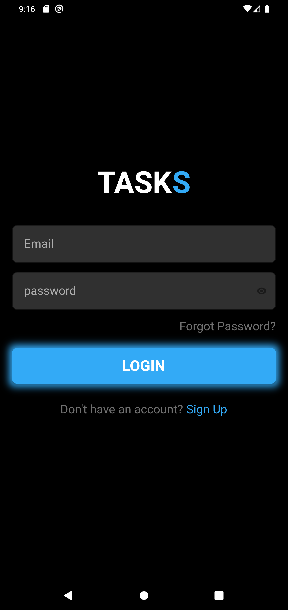
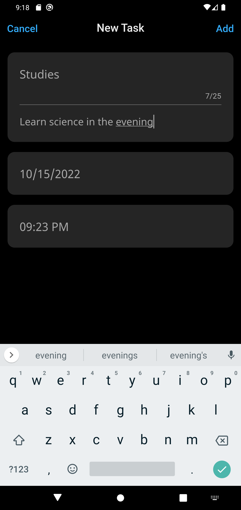
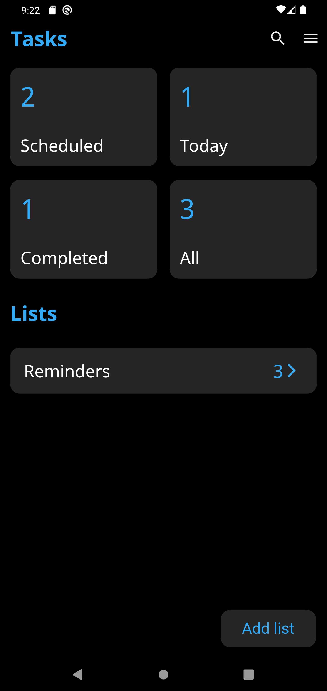
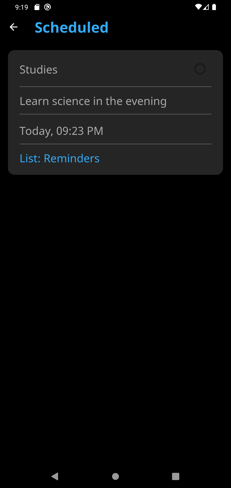
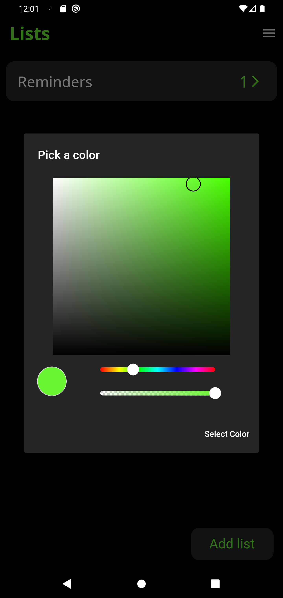

<h1 align="center">
  <br>
  <a href=""></a>
  <br>
  Tasks - Simple & Clean
  <br>
</h1>

<h4 align="center">A minimal todo app made using <a href="https://flutter.dev" target="_blank">Flutter</a>.</h4>

## Screenshots

||||
|--|--|--|
|  |  | |
|  |  | |

## Key Features

* Multi-list Todo app
* User Authentication using Firebase Auth
* Tasks are stored in Firestore DB
* Tasks can be added, deleted, marked as done
* Tasks can be scheduled at a specific date and time
* Multi-color theme
* Minimal and clean
* Test

# Command
### Install dependencies

```sh
flutter pub get
```

### Run application

```sh
flutter emulators --launch <emulator_name>
flutter run
```

### Build

```sh
flutter build apk
```


# Tech Stack

- [Flutter](https://flutter.dev)
- [Getx](https://pub.dev/packages/get) // State management
- [Firebase](https://firebase.google.com/) // Authentication
- [Firestore](https://firebase.google.com/products/firestore) // Database
